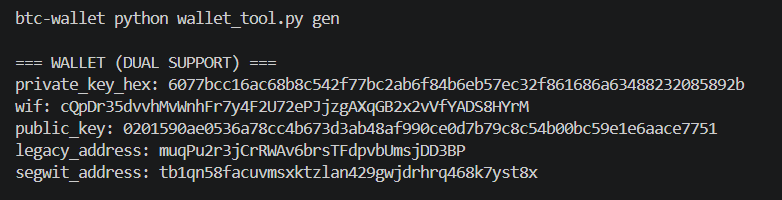
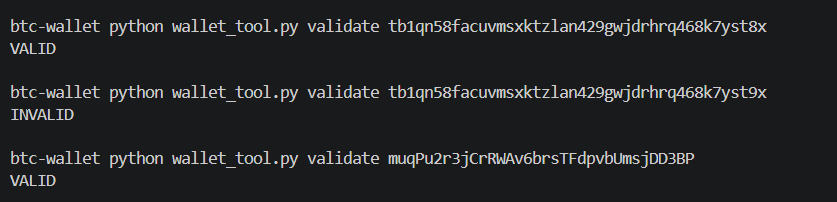
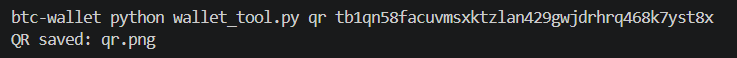
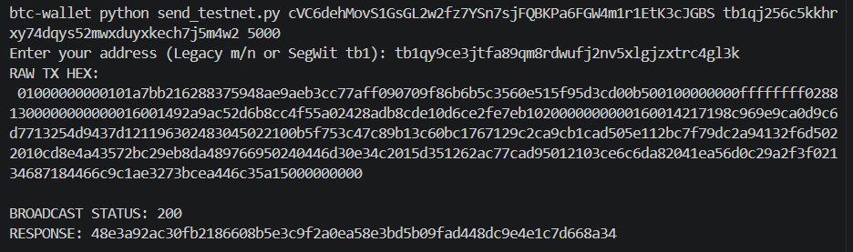

#  Bitcoin Testnet Wallet Toolkit


A lightweight, dependency-minimal Bitcoin Testnet toolkit written in pure Python. It implements core Bitcoin functionality from scratch, including ECDSA (secp256k1) key generation, WIF encoding/decoding, Legacy (P2PKH) and Native SegWit (P2WPKH) address generation, address validation, QR code generation, UTXO management, raw transaction construction, BIP143 transaction signing, and transaction broadcasting via the Blockstream Testnet API—without relying on high-level Bitcoin libraries

> ⚠️ **Testnet only.** This tool is configured for Bitcoin Testnet (`tb`, `\xef`, `\x6f`).  
> Do **not** use it with real mainnet funds.

---

## 📁 Project Structure

```
btc-testnet-wallet/
├── wallet_tool.py        # Key generation, address derivation, QR, validation
├── send_testnet.py        # UTXO fetcher, transaction builder & broadcaster
├── wallet.json            # Auto-generated after running `gen` (gitignored)
├── qr.png                 # Auto-generated QR output (gitignored)
├── examples/
├── requirements.txt
└── README.md
```

---

## ⚙️ Installation

```bash
git clone https://github.com/abderrahmane-imlouli/btc-testnet-wallet.git
cd btc-testnet-wallet
pip install -r requirements.txt
```

**`requirements.txt`**
```
ecdsa
base58
qrcode[pil]
requests
```

---

##  Usage

### 1. Generate a New Wallet

Creates a fresh private key, derives Legacy and SegWit addresses, and saves everything to `wallet.json`.

```bash
python wallet_tool.py gen
```

**Example output:**
```
=== WALLET (DUAL SUPPORT) ===
private_key_hex : 3a1f...c9d2
wif             : cTk8...Xp2F
public_key      : 03ab...44ef
legacy_address  : mxYz...3kQp
segwit_address  : tb1q...7rwm
```
**Real example** :


---

### 2. Validate an Address

Checks whether a Legacy (`m/n`) or SegWit (`tb1`) testnet address is valid.

```bash
python wallet_tool.py validate <address>
```

**Examples:**
```bash
python wallet_tool.py validate mxYz3kQpAbCdEfGhIjKlMnOpQrStUvWx
# → VALID

python wallet_tool.py validate tb1qw508d6qejxtdg4y5r3zarvary0c5xw7kxpjzsx
# → VALID

python wallet_tool.py validate 1FakeMaiNnEtaDdReSsXxXxXx
# → INVALID
```
**Real example** :


---

### 3. Generate a QR Code

Creates a PNG QR code for any text (address, transaction ID, etc.).

```bash
python wallet_generator.py qr <text> [--out filename.png]
```

**Examples:**
```bash
# QR for a testnet address (saved to qr.png by default)
python wallet_generator.py qr tb1q...7rwm

# QR saved to a custom file
python wallet_generator.py qr tb1q...7rwm --out my_address_qr.png
```
**Real example** :


---

### 4. Send a Transaction

Fetches UTXOs from Blockstream, builds and signs a raw transaction, then broadcasts it.

```bash
python send_testnet.py <WIF> <to_address> <amount_satoshis>
```

The script will prompt you to enter your **sending address** interactively.

**Example — Legacy to Legacy:**
```bash
python send_testnet.py cTk8...Xp2F mDestination...Addr 50000
Enter your address (Legacy m/n or SegWit tb1): mYourAddress...
```

**Example — SegWit to SegWit:**
```bash
python send_testnet.py cTk8...Xp2F tb1qDestination...addr 50000
Enter your address (Legacy m/n or SegWit tb1): tb1qYourAddress...
```

**Example output:**
```
RAW TX HEX:
 0200000001...

BROADCAST STATUS: 200
RESPONSE: 3a9f1c...txid...
```
**Real example** :



> 💡 Default fee is **500 satoshis**. Change can be modified inside `send()` in the source.

---

##  Security Notes

| What            | Detail                                                 |
|-----------------|--------------------------------------------------------|
| Network         | Bitcoin **Testnet** only                               |
| WIF prefix      | `\xef` (testnet)                                       |
| Address prefix  | `\x6f` → `m/n` (Legacy), `tb` (SegWit)                 |
| Key compression | SegWit requires compressed keys (WIF ends with `\x01`) |
| Private keys    | Never logged, never sent over the network              |
| `wallet.json`   | Add to `.gitignore` — contains your raw private key    |

---

##  API

Uses [Blockstream Testnet API](https://blockstream.info/testnet/api) for:
- UTXO lookup: `GET /address/{addr}/utxo`
- Broadcasting: `POST /tx`

No API key required.

---

##  Getting Testnet Bitcoin (tBTC)

You need testnet coins to test sending. Use any of these faucets:

- https://coinfaucet.eu/en/btc-testnet/
- https://bitcoinfaucet.uo1.net/

Paste your `legacy_address` or `segwit_address` from `wallet.json` to receive free tBTC.

---

##  Dependencies

| Package    | Purpose                                           |
|------------|---------------------------------------------------|
| `ecdsa`    | secp256k1 key generation and DER signing          |
| `base58`   | WIF encoding/decoding and Legacy address encoding |
| `qrcode`   | QR image generation                               |
| `requests` | HTTP calls to Blockstream API                     |

---

##  License

Released under the MIT License — see the [LICENSE](LICENSE) file for details.
Built for educational and testing purposes only.
